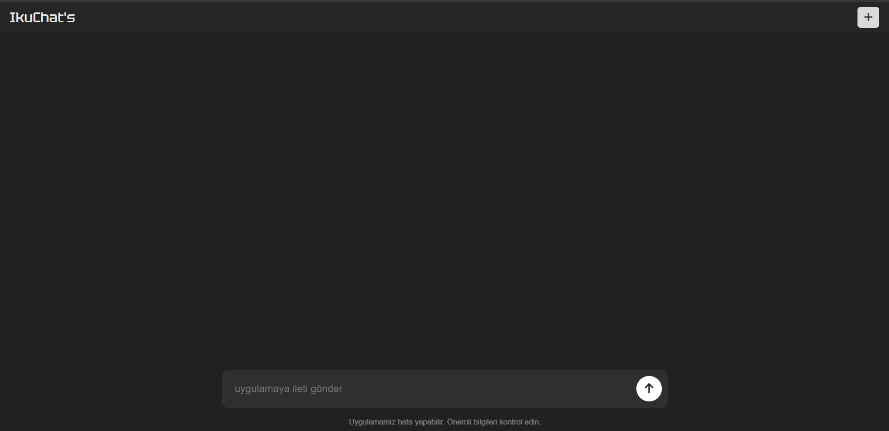
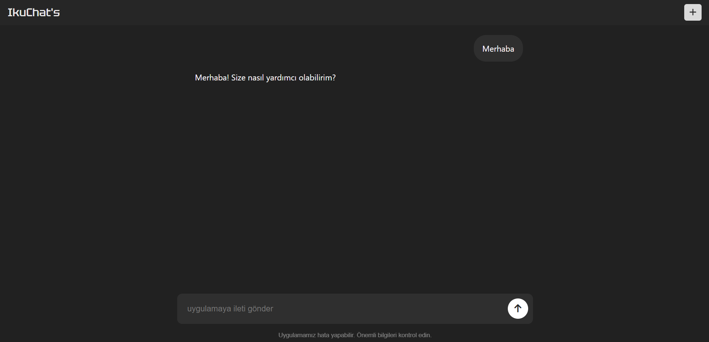
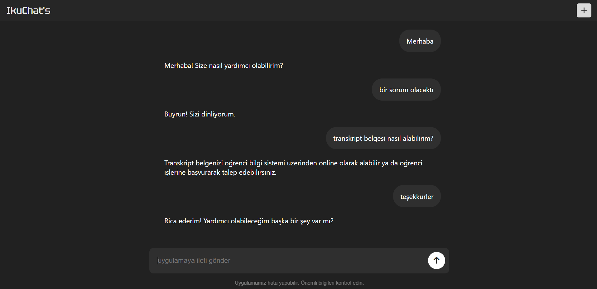

# İKÜ Daire Başkanlığı ChatBot Sistemi

Bu proje, İKÜ Daire Başkanlığı için oluşturulmuş bir soru-cevap sistemidir. Flask kullanılarak Python ile geliştirilmiştir. Sistem, JSON formatındaki bir dosyada yer alan sorulara ve yanıtlarına göre, kullanıcılardan gelen sorulara otomatik olarak yanıt verir. Yakın eşleşmeleri algılayabilen bir kütüphane ile geliştirilmiştir.

## Özellikler
- JSON dosyasından sorular ve yanıtları otomatik yükleme.
- Gelen sorulara en uygun yanıtı sağlama.
- Yakın eşleşmeleri algılayarak kullanıcı hatalarına tolerans sağlama.
- Python ve Flask ile basit ve hızlı API geliştirme.

## Kullanılan Teknolojiler
- **Python**: Ana dil.
- **Flask**: API geliştirme için mikroframework.
- **Fuzzy Matching (fuzzywuzzy)**: Yakın eşleşmeleri algılamak için.
- **JSON**: Soru-cevap verilerini saklamak için.

## Kurulum

Bu projeyi çalıştırmak için şu adımları takip edin:

1. Bu depoyu klonlayın:
   ```bash
   git clone https://github.com/kullaniciadi/iku-soru-cevap-sistemi.git

2. Gerekli bağımlılıkları yükleyin:
   ```bash
   pip install -r requirements.txt

3. Uygulamayı başlatın:
   ```bash
   flask run

## Katkıda Bulunma

Depoyu forklayın, yeni bir dal oluşturun (`git checkout -b yeni-ozellik`), değişikliklerinizi commit edin (`git commit -m "Yeni özellik ekleme"`), dalınızı push edin (`git push origin yeni-ozellik`), ve bir **Pull Request** gönderin.

## Önizleme



